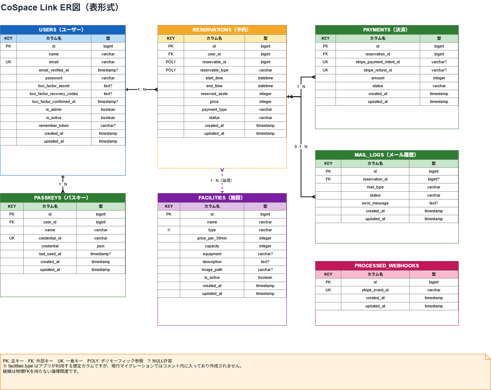

# CoSpace Link

複数のコワーキングスペースを、エリア・日時・設備から横断検索して予約できるポータル型システムです。一般ユーザー、店舗管理者、全体管理者の3ロールに対応しています。

## 主な機能

### 一般ユーザー

- 会員登録、メール認証、ログイン、プロフィール編集
- エリア、キーワード、日時、種別、設備タグによる空き施設検索
- 30分単位の空き状況、重複予約防止、エリア席の定員管理
- Stripeカード決済、現地払い、無料予約
- 予約履歴、キャンセル、Stripe返金、メール通知

### 店舗管理者

- 自店舗ダッシュボード
- 店舗情報、営業時間、画像、店舗共通設備の編集
- 施設の登録・編集・公開管理、施設固有設備の設定
- 自店舗の予約・売上・返金確認、CSV出力

### 全体管理者

- ポータル全体の集計
- 加盟店舗の登録、編集、掲載停止、再掲載
- 店舗管理者の招待
- 全施設、全予約、会員、代理予約の管理

## 設備タグ

| 区分         | タグ                                            |
| ------------ | ----------------------------------------------- |
| 店舗共通設備 | Wi-Fi、電源、フリードリンク                     |
| 施設固有設備 | モニター、ホワイトボード、防音、Web会議ブース可 |

## 使用技術

- PHP 8.3以上（Sail: PHP 8.5）
- Laravel 13 / Laravel Fortify
- MySQL 8.4 / Redis / Nginx
- Stripe Checkout / Webhook / Refund API
- Docker Compose / Laravel Sail / Mailpit
- PHPUnit 12

## 環境構築

```bash
git clone git@github.com:toomochin/cospace-link.git
cd cospace-link
cp .env.example .env
composer install
```

`.env` の主な開発用設定:

```dotenv
APP_URL=http://localhost
DB_CONNECTION=mysql
DB_HOST=mysql
DB_PORT=3306
DB_DATABASE=cospace_link
DB_USERNAME=sail
DB_PASSWORD=password
REDIS_HOST=redis
開発環境ではメール確認用に Mailpit を使用しています。
MAIL_MAILER=smtp
MAIL_HOST=mailpit
MAIL_PORT=1025
MAIL_FROM_ADDRESS=admin@example.com
```

```bash
./vendor/bin/sail up -d --build
./vendor/bin/sail artisan key:generate
./vendor/bin/sail artisan migrate --seed
./vendor/bin/sail artisan storage:link
./vendor/bin/sail artisan test
```

DBを作り直す場合:

```bash
./vendor/bin/sail artisan migrate:fresh --seed
```

## Stripe設定

```dotenv
STRIPE_SECRET=sk_test_...
STRIPE_WEBHOOK_SECRET=whsec_...
※ここを自分のStripeのキーに差し替えてください
```

```bash
stripe listen --forward-to http://localhost/stripe/webhook
```

購読イベントは `checkout.session.completed` と `checkout.session.expired` です。

## 初期アカウント

`migrate:fresh --seed` で作成され、パスワードはすべて `password` です。

| ロール       | メールアドレス      | 所属         |
| ------------ | ------------------- | ------------ |
| 全体管理者   | `admin@example.com` | ポータル全体 |
| 店舗管理者   | `owner@example.com` | CoSpace 渋谷 |
| 一般ユーザー | `test@example.com`  | なし         |

## 開発用URL

| サービス   | URL                   |
| ---------- | --------------------- |
| アプリ     | http://localhost      |
| phpMyAdmin | http://localhost:8080 |
| Mailpit    | http://localhost:8025 |

## 主要テーブル

| テーブル       | 用途                                         |
| -------------- | -------------------------------------------- |
| `shops`        | 加盟店舗、営業時間、店舗共通設備、掲載状態   |
| `facilities`   | 施設、30分料金、定員、施設固有設備、公開状態 |
| `users`        | 3ロールと店舗所属                            |
| `reservations` | 予約日時、人数、料金、決済方法、状態         |
| `payments`     | Stripe決済・返金情報                         |

## ER図



- [Mermaid版](docs/er-diagram.md)

## テスト

```bash
./vendor/bin/sail artisan test
```
