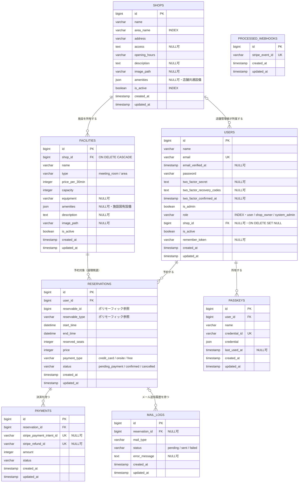
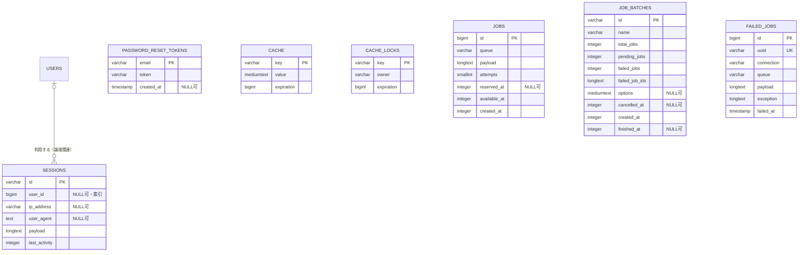

# ER図

このER図は `database/migrations` の定義を基準に、2026年7月31日時点の
データベース構造を表したものです。

## 業務テーブル

### 関連の補足

- `facilities.shop_id` → `shops.id` は物理外部キーです。店舗削除時に施設も削除されます。
- `users.shop_id` → `shops.id` はNULL許容の物理外部キーです。店舗削除時はNULLへ更新されます。`shop_owner` は1店舗に所属する前提です。
- `shops.amenities` はWi-Fi・電源・フリードリンクなどの店舗共通設備を保持します。
- `facilities.amenities` はモニター・ホワイトボード・防音・Web会議ブース可などの施設固有設備を保持します。
- `reservations.user_id` → `users.id` は物理外部キーです。ユーザー削除時に予約も削除されます。
- `reservations.reservable_id` と `reservations.reservable_type` はLaravelのポリモーフィック関連です。現在の実装では `facilities` が予約対象ですが、データベース上の物理外部キーはありません。
- `payments.reservation_id` → `reservations.id` は物理外部キーです。予約削除時に決済も削除されます。`reservation_id` に一意制約はないため、1予約に複数の決済レコードを保持できます。
- `mail_logs.reservation_id` → `reservations.id` はNULL許容の物理外部キーです。予約削除時は `NULL` に更新され、送信履歴は残ります。
- `processed_webhooks` はStripeイベントの重複処理を防ぐ独立テーブルです。

## Laravel基盤テーブル

アプリケーションの業務データとは直接関連しない、認証・セッション・キャッシュ・
キュー用のテーブルです。

`sessions.user_id` には索引がありますが、マイグレーション上の外部キー制約はありません。
